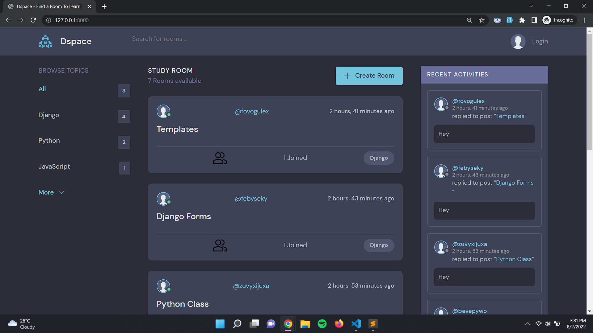
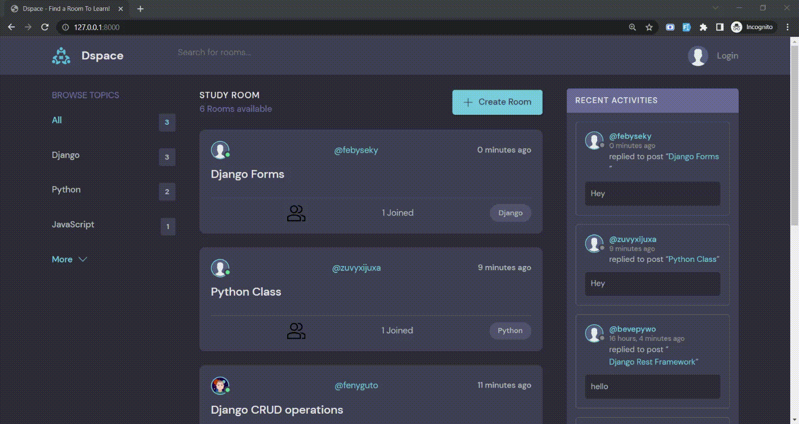

<h1 align="center">
   
  Dspace
   
</h1>

<h4 align="center">An web application where users can create/modify rooms.</h4>

  <a href="#overview">Overview</a> •
  <a href="#built-with">Build with</a> •
  <a href="#links">Live links</a>

## Overview

### The functiionalities

Users should be able to:

- Create Rooms based on topics.
- Join rooms.
- comment on rooms.

## Built with

- [![Django][Django.com]][Django-url] 
- [![Bootstrap][Bootstrap.com]][Bootstrap-url] 
- [![SQLite][SQLite.com]][SQLite-url]

## Links

- Solution URL: [GitHub](https://github.com/manupranav/DSpace)
- Live Site URL: [Dspace](https://dspaces.herokuapp.com/)

[Bootstrap.com]: https://img.shields.io/badge/Bootstrap-563D7C?style=for-the-badge&logo=bootstrap&logoColor=white
[Bootstrap-url]: https://getbootstrap.com
[Django.com]: https://img.shields.io/badge/Django-092E20?style=for-the-badge&logo=django&logoColor=white
[Django-url]: https://www.djangoproject.com/
[SQLite.com]: https://img.shields.io/badge/SQLite-07405E?style=for-the-badge&logo=sqlite&logoColor=white
[SQLite-url]: https://www.sqlite.org/index.html
[Postgresql.com]: https://img.shields.io/badge/PostgreSQL-316192?style=for-the-badge&logo=postgresql&logoColor=white
[Postgresql-url]: https://www.postgresql.org/

    	
        